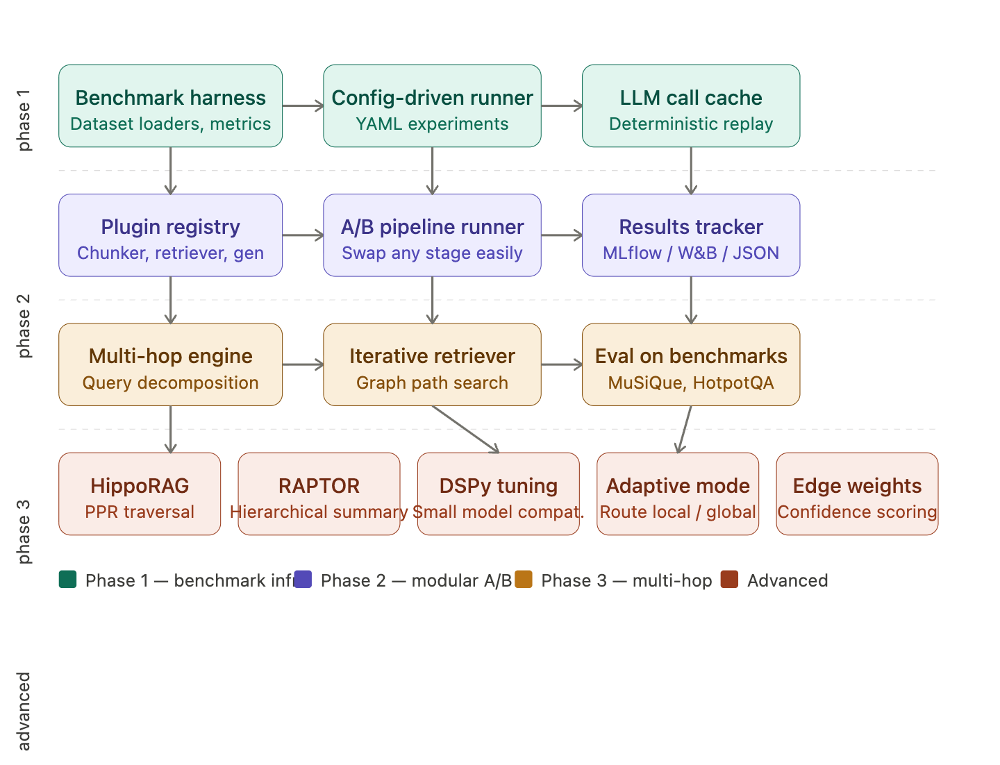
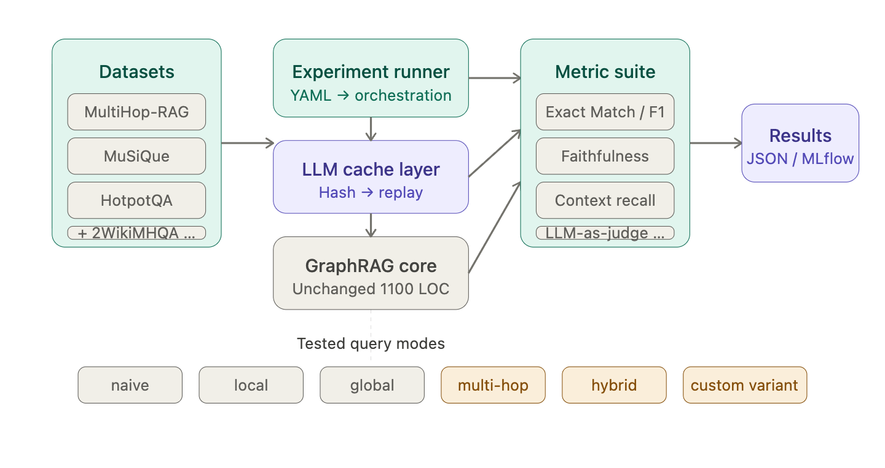
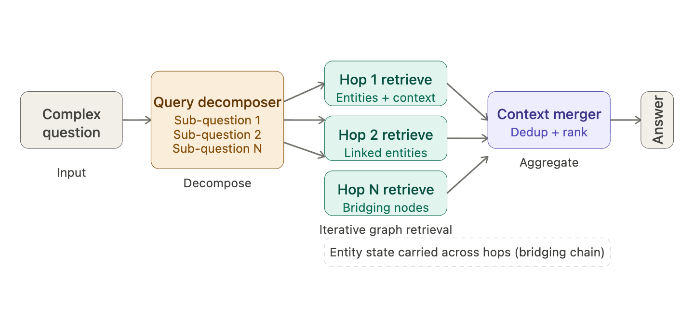
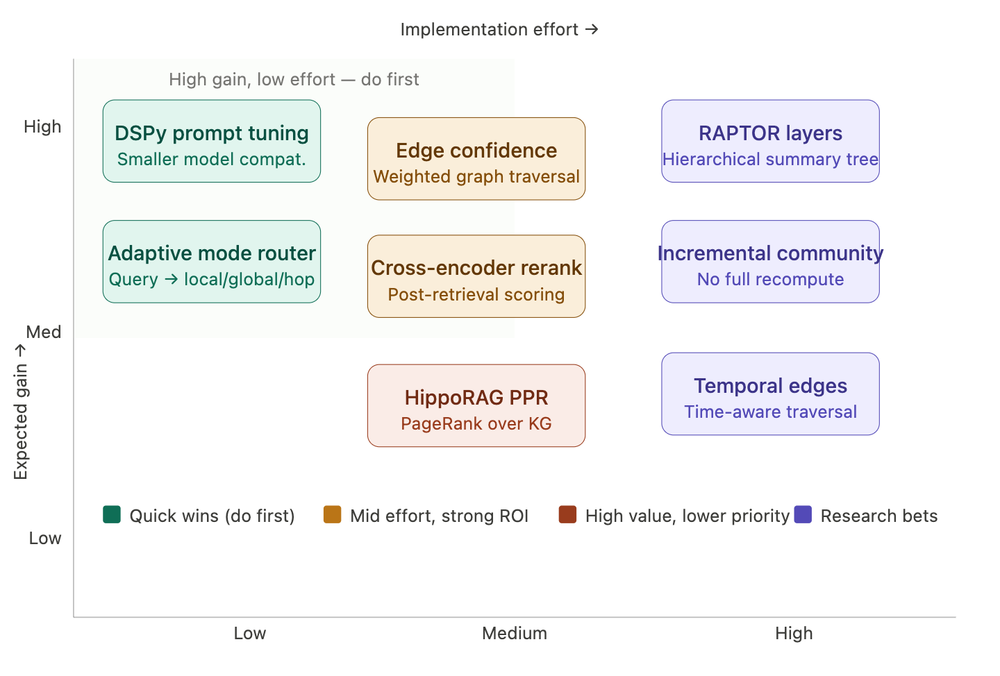

## Overview

The core idea is to layer a **benchmark & experimentation framework** on top of the existing hackable ~1100-line core — without polluting it. The project's strengths (swappable storage, async-first, pluggable LLM/embed functions) are already the right foundation. What's missing is a harness to run controlled experiments, compare variants, and evaluate systematically.



------

## Phase 1 — Benchmark Infrastructure ✅

**Status:** COMPLETED (2026-03-23)

The goal here is zero friction to go from "I have a question" to "I have a number." Every component in this phase serves reproducibility.

**Dataset loaders.** ✅ Standardise ingestion for the canonical multi-hop benchmarks: MultiHop-RAG (already partially evaluated in the repo), MuSiQue, 2WikiMultiHopQA, and HotpotQA. A shared `BenchmarkDataset` protocol gives each a `questions()` and `corpus()` method, so the runner doesn't care which dataset is active.

**Metrics framework.** ✅ Implement Exact Match, token-level F1, and optional LLM-as-judge faithfulness (via Ragas). Wrap them in a `MetricSuite` class that takes a `(prediction, gold)` pair and returns a structured dict. This is the single source of truth for any comparison.

**LLM call cache.** ✅ This is the most important quality-of-life feature for rapid iteration. Every `best_model_func` and `cheap_model_func` call hashes its prompt and stores the response. Re-running the same experiment uses cached responses instantly, cutting cost and time to near-zero for ablation runs. The existing `hashing_kv` pattern in the codebase already hints at this — formalise it.

**Config-driven experiment runner.** ✅ A YAML schema that fully specifies an experiment — dataset, split, graphrag config, query modes to test, metrics to compute. The runner executes it, stores results alongside the config for full reproducibility.

### Implementation Details

- **Package:** `nano_graphrag/_benchmark/` (~1100 lines across 5 files)
- **Components:**
  - `datasets.py`: Dataset loaders with `BenchmarkDataset` protocol
  - `metrics.py`: EM, F1, and optional Ragas metrics with `MetricSuite`
  - `cache.py`: `BenchmarkLLMCache` wrapping existing `BaseKVStorage`
  - `runner.py`: `BenchmarkConfig`, `ExperimentRunner`, `ExperimentResult`
- **CLI:** `examples/benchmarks/run_experiment.py` with YAML config support
- **Documentation:** `nano_graphrag/_benchmark/README.md`

### Usage

```bash
# Run experiment with config
uv run python examples/benchmarks/run_experiment.py --config examples/benchmarks/configs/example.yaml

# Python API
from bench import BenchmarkConfig, ExperimentRunner
config = BenchmarkConfig.from_yaml("config.yaml")
runner = ExperimentRunner(config)
result = await runner.run()
```

---



## Phase 2 — Modular A/B Architecture

This phase makes it trivially easy to swap one pipeline component and rerun, which is the core loop of experimentation.

**Plugin registry.** Define formal `Protocol` classes for each swappable stage: `Chunker`, `EntityExtractor`, `CommunityReporter`, `Retriever`, `Reranker`, `Generator`. The existing `chunk_func`, `best_model_func`, and storage class injection are the right pattern — formalise them into a registry where named variants can be declared and looked up.

**Experiment config schema extension.** Extend the YAML schema so an experiment can declare `variant_a` and `variant_b`, each specifying a different `chunker`, `retriever`, or `llm` config. The runner executes both on the same dataset split and writes a side-by-side comparison to the results store.

**Pipeline introspection.** Add a lightweight `--dry-run` mode that prints the full resolved pipeline config without executing any LLM calls. This catches config errors before incurring API cost, and doubles as documentation of what any given run actually did.

---

## Phase 3 — Multi-Hop RAG Specialisation

This is where nano-graphrag's graph structure becomes a genuine differentiator over plain vector RAG.




The multi-hop engine adds a new `QueryParam(mode="multihop")` that triggers an iterative loop: decompose the original question into sub-questions using the LLM, retrieve entities and context for each sub-question using graph-aware local search, carry bridging entities forward into the next hop's context window, then merge and deduplicate all retrieved context before final generation. The graph structure makes cross-document entity linking significantly cheaper here than in plain vector RAG — this is the core thesis worth measuring on MuSiQue and HotpotQA.

---

## Advanced TechniquesHere's the breakdown of each technique and its rationale:



**DSPy prompt tuning** — the existing roadmap already flags this. Using DSPy's `BootstrapFewShot` to optimise the `entity_extraction` and `community_report` prompts against a small labelled set can unlock sub-7B model compatibility without hand-crafting prompts. Low implementation cost, high leverage since extraction quality gates everything downstream.

**Adaptive mode router** — add a lightweight classifier (even just a few-shot LLM call or a small embedding-similarity heuristic) that routes an incoming query to `local`, `global`, or `multihop` mode before retrieval begins. Simple comparative questions → `local`. Thematic summaries → `global`. Bridging questions between named entities → `multihop`. This eliminates the burden of requiring the caller to specify mode.

**Edge confidence weighting** — during entity extraction, score each relationship triple with a confidence value derived from the extraction LLM's self-reported certainty or from occurrence frequency across chunks. Weight graph traversal by these scores so high-confidence edges are preferred. This directly improves precision in multi-hop paths where spurious edges mislead the reasoning chain.

**Cross-encoder reranker** — after local retrieval returns top-K candidate chunks/communities, pass them through a cross-encoder (e.g. a small `bge-reranker` or `ms-marco` model) to re-score relevance against the original query. This is architecturally a clean post-retrieval stage that plugs into the existing `only_need_context=True` interface.

**HippoRAG PPR** — replace or augment the current vector similarity retrieval with Personalized PageRank over the knowledge graph, seeded by query entities. This is how HippoRAG achieves multi-hop recall without iterative LLM calls — the graph topology does the bridging. High expected gain for multi-hop benchmarks specifically.

**RAPTOR-style hierarchical summaries** — augment the community report structure with a recursive summarisation tree: leaf-level chunk summaries → cluster summaries → community summaries → global summaries. Enables retrieval at the right granularity level depending on query scope, improving both precision (for specific queries) and recall (for broad ones).

**Incremental community update** — the current implementation recomputes all communities on every insert, which becomes expensive at scale. The `20260318-incremental-community-update-research.md` doc already identifies this. Implementing delta-Leiden (only re-cluster affected subgraphs) is the right path; this unblocks production use cases where documents arrive continuously.

**Temporal graph edges** — stamp each extracted relationship with a time range (where available in the source text), and weight traversal to favour temporally relevant facts for time-sensitive queries. This is a research bet — valuable for news/legal/medical corpora but complex to get right.

---

**Suggested sequencing:** Phase 1 → DSPy tuning + adaptive router (both land within Phase 1/2 infra work) → edge confidence + reranker → Phase 3 multi-hop engine → HippoRAG PPR → RAPTOR → incremental communities → temporal. The benchmark harness built in Phase 1 is what makes every subsequent improvement measurable, so it pays off the entire effort.